# HospitalAPI
Добро пожаловать! Перед установкой программы, необходимо ознакомиться с данной инструкцией!
## БД
В самом начале работы с программой необходимо установить базу данных себе на локальный сервер localdb.

Файл называется med.sql.

Для этого:
1. Открыть MS SQL 2019.
2. Подключиться к локальному серверу.
3. Создать БД MedPatient.
4. Открыть скрипт.
5. Запустить скрипт.

Отлично!. Теперь на вашем локальном сервере есть нужная БД.

(В случае каких-либо проблем перезапустите СУБД)

## Запуск программы
Теперь можно перейти к самой программе!

### Врачи

Запускаем её. И перед нами интерфейс WEBAPI.

Для начала можем посмотреть как API выдаёт список врачей.

Каждая страница может содержать в себе 3 экземпляра из списка.

Сортировка работает по возрастанию. В данном случае она может сортировать врачей по:

1. name - по имени.
2. lastname - по фамилии.
3. surname - по отчеству.
4. cabinet - по кабинету.
5. specialization - по специализации.
6. sector - по участку.

Например, ниже представлен список врачей отсортированный по имени в двух страницах:

Первый список

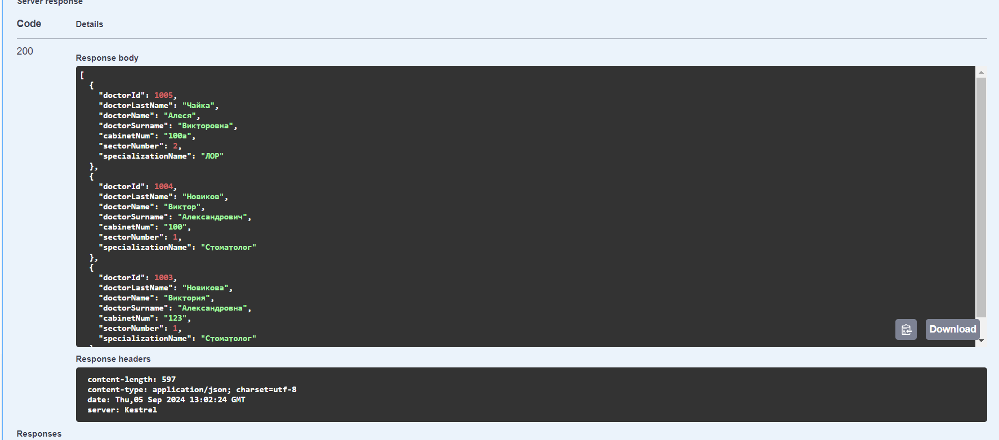

Второй список

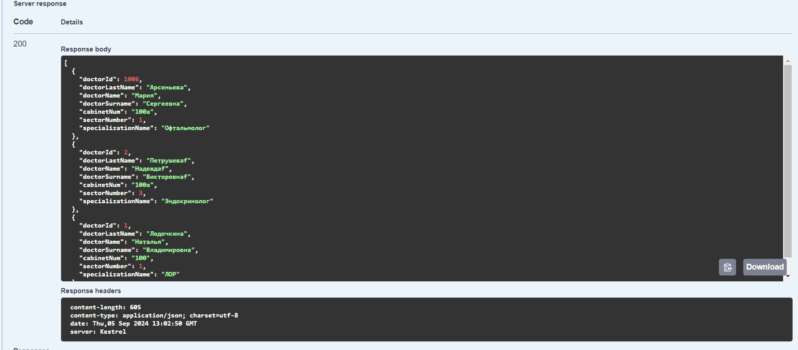

Также присутствует процесс добавления новых врачей:

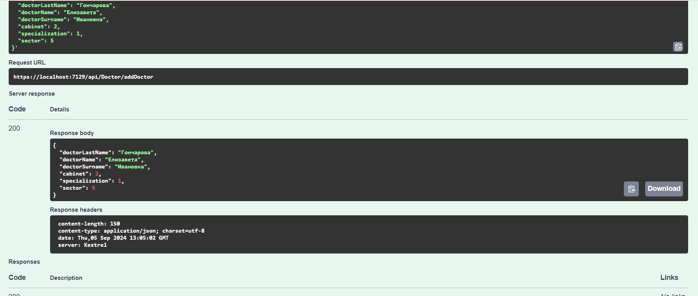

При помощи знаний id можно поменять необходимую запись в БД:

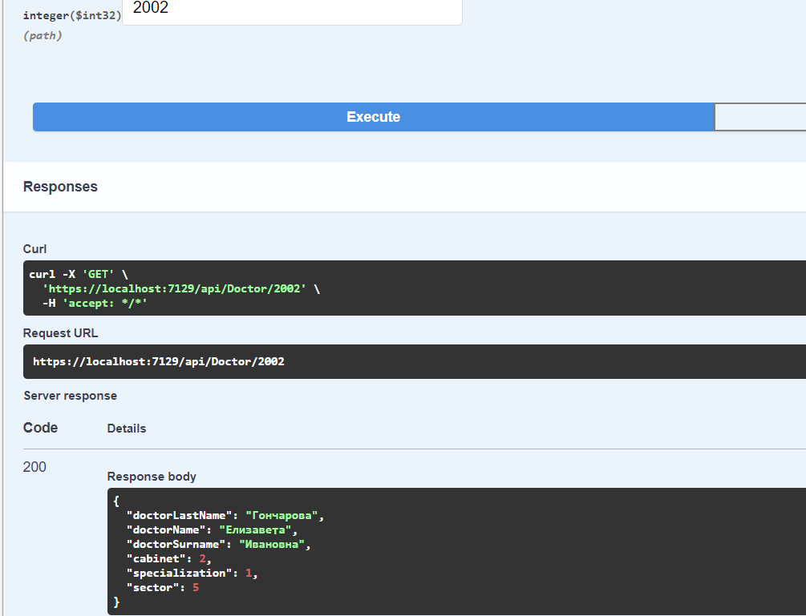

Теперь можно менять запись:

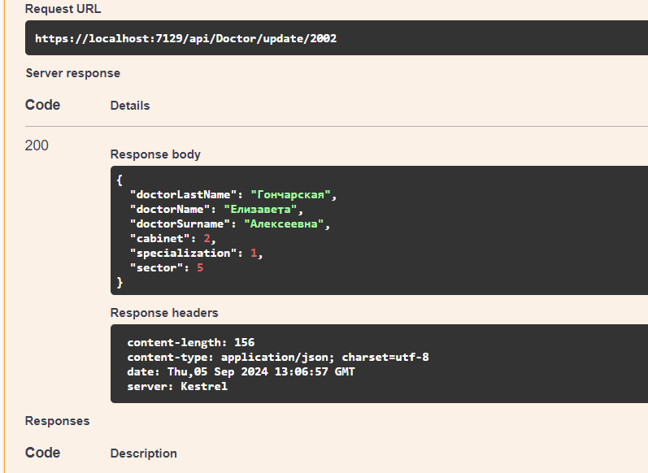

Также можно удалять запись:

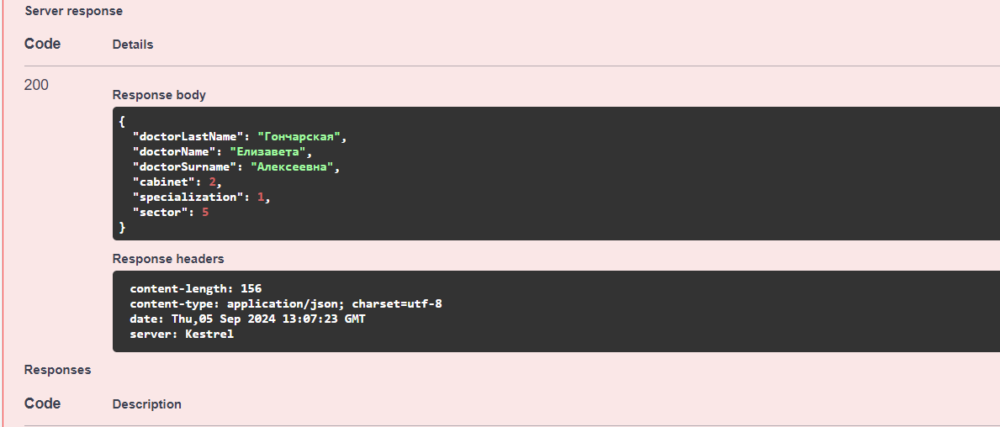

Теперь можно перейти к пациентам.

### Пациенты
Как и с врачами, у пациентов похожие функции.

При вывода списка также присутствует деление на страницы (3 записи в одной странице).

Сортировка практически идентична. Работает она следующим образом:

1. name - по имени.
2. lastname - по фамилии.
3. surname - по отчеству.
4. address - по адресу.
5. birth - по дате рождения.
6. sector - по участку.
7. gender - по полу.

Ниже представлен список пациентов в две страницы (вторая страница пустая потому что было всего 3 записи)

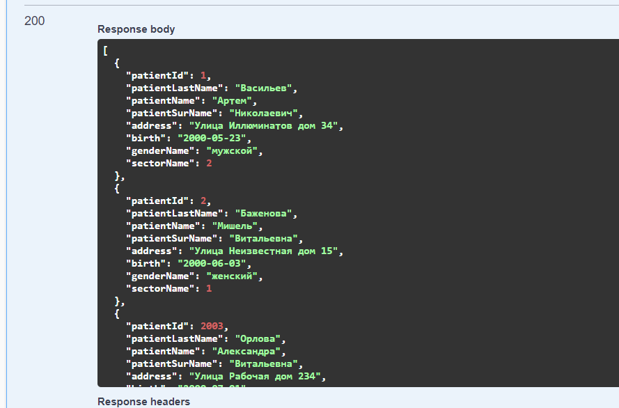

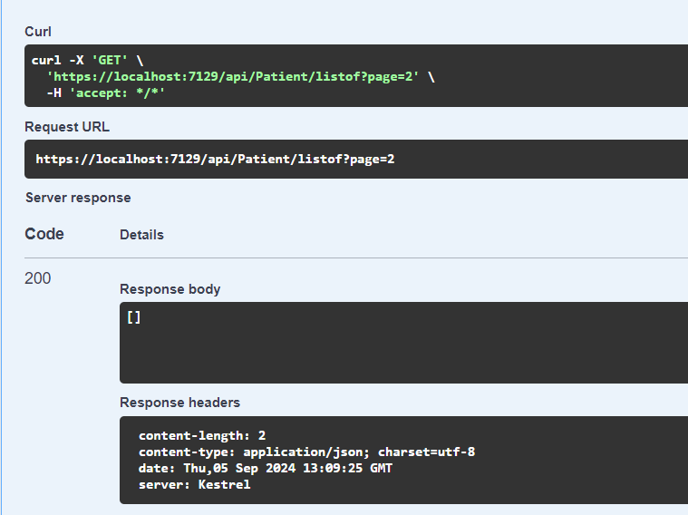

*При добавлении нового пациента API предлагает вводить дату полностью, советую менять её на "2000-01-01"*

Добавление также прекрасно работает:

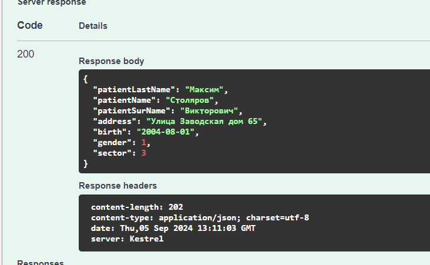

Зная Id пациента можно узнать полную о нём информацию для дальнейших целей.

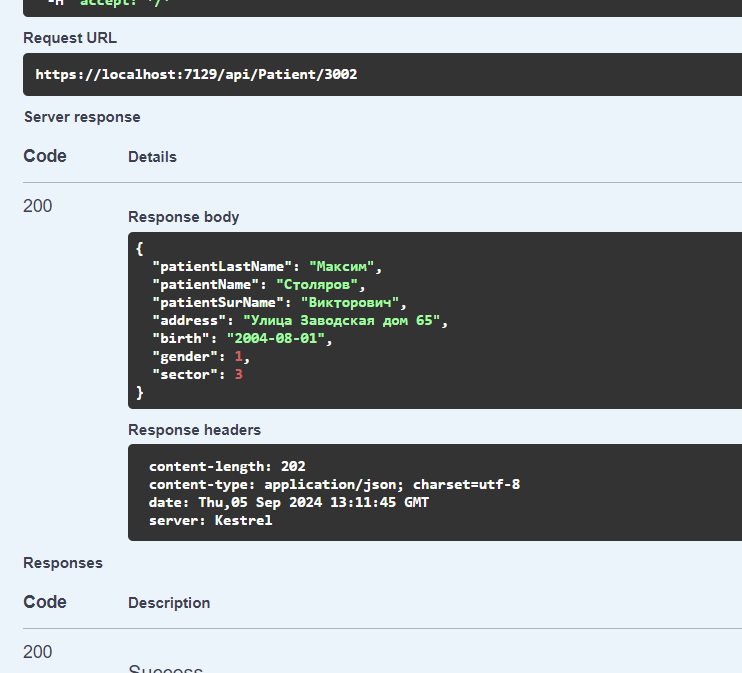

Если посмотреть внимательно, то запись написана неправильно, т.е. имя и фамилия перепутаны.

С помощью изменения можно поправить данную ситуацию:

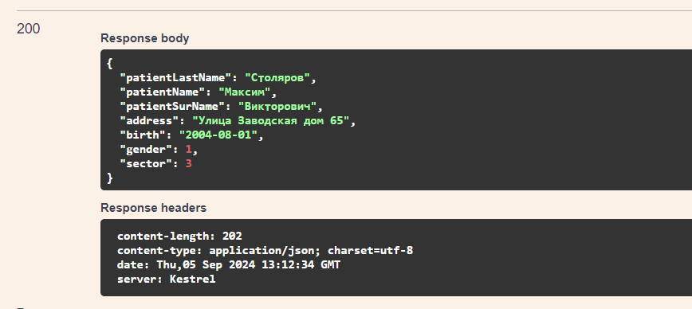

Если же данный пациент нам не нужен, то можем его просто удалить.

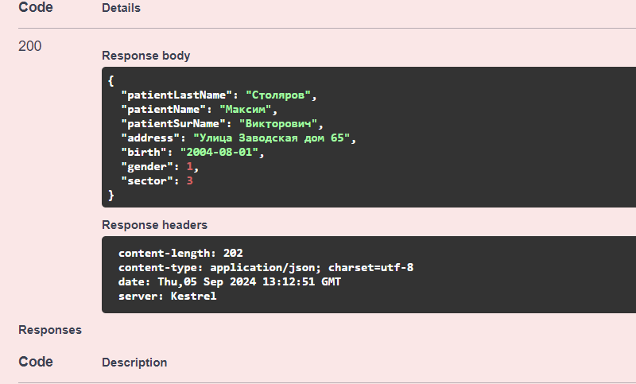

Теперь вы ознакомлены с программой!

## Заключение
Задание выполнила Пинигина Дарья.
